<p align="center">
  
</p>

<p align="center"><em>Don't trust it. Check it.</em></p>

---

**Rakshak** is an agentic honeypot and AI + ML scam-detection platform. Submit a
suspicious message, link, image, or document; it runs through ML classifiers,
multi-LLM reasoning, cybersecurity checks, and threat-intelligence correlation,
and returns a risk score with a confidence level and a full report. Optional
WhatsApp / Telegram bots let people forward content without visiting the site. An
opt-in honeypot engages scammers with AI personas to gather campaign
intelligence.

## Stack

- **Python 3.11+**, **FastAPI**, **arq** (background worker), SQLAlchemy async + **Alembic**
- **PostgreSQL + pgvector**, **Redis**, **MinIO** (S3-compatible object storage)
- **Next.js 16** (App Router) web app — `apps/web`
- Multi-provider **LLM gateway** — Gemini by default; OpenAI / Anthropic / Groq / OpenRouter / Ollama optional
- **scikit-learn** classifiers, with optional `torch` / `transformers` / `sentence-transformers` / EasyOCR
- **Docker Compose** + **Caddy** for deployment

## Monorepo layout

```
apps/
  api/            FastAPI app — routers: auth, health, investigations, threat_intel
  worker/         arq background tasks (WorkerSettings)
  web/            Next.js frontend
  telegram_bot/   Telegram webhook adapter
  whatsapp_bot/   WhatsApp (Meta Cloud API) webhook adapter
packages/
  agents/         honeypot, investigation, protection, incident_response
  domain/         entities, investigations, reports, risk, threat_intel
  ingestion/      text, url, image (OCR), pdf, audio
  llm/            gateway, router, providers, policies, prompts
  ml/             text / url / vision classifiers, inference, model registry
  reports/        generator, serializers
  threat_intel/   feeds, indicators, reputation, campaigns, correlation
  shared/         config, db, schemas, security, storage, telemetry
ml-models/        trained model artifacts
migrations/       Alembic migrations
scripts/          API-key management, dataset + model training/eval, retention purge
```

## Quickstart (Docker)

```bash
cp .env.example .env
# set GEMINI_API_KEY and API_SECRET_KEY — those two are all you need to boot
docker compose up -d
```

The stack comes up behind Caddy (`infra/docker/Caddyfile`), which fronts the web
app and the API. For a hosted install (domain, TLS, EC2 sizing), follow
[DEPLOYMENT.md](DEPLOYMENT.md).

## Local dev (no Docker)

Backend — needs Postgres + Redis + MinIO (`docker compose up -d postgres redis minio`):

```bash
uv sync
uv run alembic upgrade head
uv run main.py                                   # API on http://localhost:10000  (docs at /docs)
uv run arq apps.worker.settings.WorkerSettings   # background worker
```

Frontend:

```bash
cd apps/web
pnpm install
pnpm dev                                         # http://localhost:3000
```

`apps/web/.env.local` already points `NEXT_PUBLIC_API_URL` at `http://localhost:10000`.

## Configuration

Only `GEMINI_API_KEY` and `API_SECRET_KEY` are required in development. Everything
else in `.env.example` is optional and self-documenting:

| Group | Notes |
|-------|-------|
| **LLM providers** | Fill only the keys you have. An unconfigured provider reports `DISABLED` and the task router skips it. Any `*_API_KEY` accepts a comma-separated list for failover. |
| **Channels** | `TELEGRAM_BOT_TOKEN` + `TELEGRAM_WEBHOOK_SECRET`, or the `WHATSAPP_*` set. Without its secret, a webhook rejects every request. |
| **Honeypot** | `HONEYPOT_ENABLED` + `HONEYPOT_RESEARCHER_KEY`. In `ENVIRONMENT=production`, startup fails loudly if the honeypot is enabled without its key. |

Scoped API keys are created out of band, never stored in `.env`:

```bash
uv run python scripts/manage_api_keys.py create --principal <name> --scopes <scope...>
```

## Optional ML extras

```bash
uv sync --extra ml         # torch + transformers — zero-shot / spam HF pipelines
uv sync --extra semantic   # sentence-transformers embedding classifier
uv sync --extra ocr        # EasyOCR local image text extraction
```

`torch` / `torchvision` are pinned to the CPU-only wheel index (`[tool.uv.sources]`),
so these stay small and GPU-free.

## Tests

```bash
uv run pytest
cd apps/web && pnpm lint
```

## The animated mark

The header above is [`assets/rakshak-banner.svg`](assets/rakshak-banner.svg) — a
standalone SMIL-animated version of the app's **Guardian Orbit**: a shield-and-flame
core inside two counter-rotating rings of threat and defense signals, with a
sweeping scan line. In the app it lives at
[`apps/web/src/components/intelligence-core.tsx`](apps/web/src/components/intelligence-core.tsx)
as a pure-CSS, server-rendered component (`rk-spin` / `rk-spin-rev` / `rk-breathe`
keyframes in `apps/web/src/app/globals.css`), authored on a Claude Design canvas.
